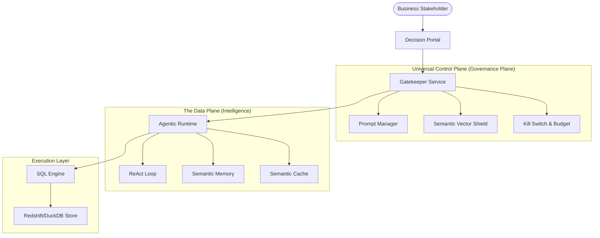

# 🚀 Agentic Analytics Platform
### The Enterprise Agentic Decision System

[](LICENSE)
[](docs/architecture.md)
[](docs/architecture.md)

---

## 📄 Overview
The **Agentic Analytics Platform** is a production-grade **Agentic Decision System** designed to bridge the "Autonomy-Trust Gap" in enterprise data. Unlike standard chatbots that simply generate SQL, this platform implements a **Governed Six-Layer Runtime** that plans, executes, and self-corrects while remaining under the absolute control of a centralized **Governance Plane**.

---

## ⚠️ The Problem Statement
### The "Autonomy-Trust Gap"
In the enterprise, the adoption of LLM-based data agents is blocked by three critical failures:
1.  **Hallucination Risk**: Standard Text-to-SQL tools generate syntactically correct queries that are physically impossible or semantically incorrect.
2.  **Governance Blindness**: Agents often lack a "Kill Switch" or cost-awareness, leading to unpredictable API burn or destructive database actions.
3.  **Complexity Barrier**: Business users require complex comparative analysis (e.g., "Forecast vs. Actuals"), which traditional RAG architectures struggle to coordinate over multi-turn conversations.

---

## ✅ The Solution: Governed Autonomy
We provide a framework for **Governed Autonomy**, where the agent's reasoning (the Data Plane) is strictly separated from its policy enforcement (the Control Plane). 

### Key Innovations:
*   **The Six-Layer Runtime**: A modular architecture for Perception, Memory, Planning, Action, Control, and Governance.
*   **Universal Control Plane**: A "Geofence" that intercepts every intent and enforces semantic and operational safety.
*   **Self-Healing ReAct Loop**: Automated multi-step reasoning that detects its own failures and iterates toward the correct answer.

---

## 🏗️ System Architecture
The platform follows a **Control Plane vs. Data Plane** separation of concerns.



---

## 💡 In Layman's Terms: "How it Works"
Imagine you have a highly skilled **Financial Analyst** (the Agent) and a **Strict Compliance Officer** (the Control Plane).

1.  **Request**: You ask the Analyst "Show me the profit for East Region."
2.  **Governance**: Before the Analyst even looks at the data, the Compliance Officer checks the request: *"Is this a restricted topic? Is the budget exceeded?"*
3.  **Reasoning**: The Analyst searches the company's "Memory" (RAG) to find where 'Profit' and 'East Region' are stored.
4.  **Execution**: The Analyst writes the report (SQL) and runs it.
5.  **Self-Correction**: If the report has an error, the Analyst catches it, fixes it, and only then presents the final, verified chart to you.

---

## 📂 Project Structure
```text
├── docs/                 # Detailed technical & product documentation
├── src/
│   ├── agent/            # Core ReAct logic & Control Plane implementation
│   ├── retrieval/        # Semantic RAG Engine & Vector Store
│   ├── observability/    # Telemetry, Cost tracking, & Sentry integration
│   ├── ui/               # Streamlit-based Enterprise Decision Portal
│   └── data/             # Semantic Metadata & Business Logic
├── tests/                # Automated regression & safety suite
├── LICENSE               # MIT License
└── requirements.txt      # Dependency management
```

---

## 📚 Essential Reading
For a deep dive into specific components, please refer to:
*   **[🏗️ Architecture Deep Dive](docs/architecture.md)**: Details on the Six-Layer Runtime.
*   **[📖 User Manual](docs/user_manual.md)**: How to operate the Decision Portal.
*   **[⚙️ Implementation Guide](docs/technical_implementation_guide.md)**: Engineering "War Stories" and RAG details.
*   **[📄 Executive Whitepaper](docs/whitepaper_combined.md)**: Strategic vision for Enterprise Decision Systems.

---

## 🚀 Quick Start

### Installation
```bash
# 1. Clone
git clone https://github.com/Deepak-mk/spot.git
cd agentic-analytics-platform

# 2. Setup environment
python3 -m venv venv
source venv/bin/activate
pip install -r requirements.txt

# 3. Configure
# (Add your GROQ_API_KEY to a .env file)
echo "GROQ_API_KEY=your_key_here" > .env

# 4. Run
streamlit run src/ui/streamlit_app.py
```

---

## ⚖️ License
This project is licensed under the **MIT License** - see the [LICENSE](LICENSE) file for details.

---
**Built for the AWS Product Team Showcase**
