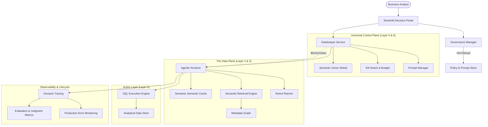

# 🏗️ System Architecture: Enterprise Agentic Decision System

> **Status**: Production Ready (AWS-Compatible)
> **Version**: 3.0.0
> **Last Updated**: March 2026

## 1. High-Level Philosophy: "Architecture Over Orchestration"

The platform is designed not as a simple chatbot, but as a **Governed Decision-Making System**. It solves the "Autonomy-Trust Gap" by implementing a strict separation between the **Data Plane** (where the agent reasons) and the **Control Plane** (where governance and safety are enforced).

### The Six-Layer Agentic Runtime
We implement a modular runtime architecture as described in our core design principles:
1.  **Perception Layer**: Ingests natural language and maps to semantic intent.
2.  **Memory Layer**: Distinguishes between **Knowledge** (RAG), **Context** (CAG), and **Rules** (KAG).
3.  **Planning Layer**: Tactical reasoning via the ReAct (Reasoning + Acting) loop.
4.  **Action Layer**: Secure interface for tool execution and data retrieval.
5.  **Control Plane**: The external "Joystick" for real-time governance and policy enforcement.
6.  **Governance Layer**: Persistent safety protocols, budget limits, and auditability.

---

## 2. Component Architecture

---

## 3. Operational Layers

### 3.1. The Memory Framework (Layer 2)
Unlike standard RAG, we utilize a **Multi-Tier Memory** architecture:
*   **Knowledge (RAG)**: Static schema definitions and business rules embedded in FAISS.
*   **Context (CAG)**: Pre-computed "Data Signatures" of previous hits to enable multi-turn comparative analysis.
*   **Logic (KAG)**: DynamicFew-Shot examples injected based on human feedback (👍/👎).

### 3.2. Universal Control Plane (Layer 5)
The Control Plane acts as the **Geofence** for the agent. It is physically isolated from the LLM's reasoning loop to prevent prompt injection from bypassing safety filters.
*   **Semantic Shield**: Cosine-similarity check against forbidden concepts.
*   **Hot-Reloadable Policy**: Update business rules at runtime via the Governance Manager.

---

## 4. The Decision Flow

1.  **Perceive**: Ingest NL query -> Control Plane check.
2.  **Reason**: Planner identifies needed metrics vs available schema.
3.  **Retrieve**: Semantic match "Earnings" -> `SUM(revenue)`.
4.  **Act**: Generate & Execute valid OLAP SQL.
5.  **Observe**: Self-correct if results are anomalous or empty.
6.  **Learn**: Persist feedback for future prompt optimization.

---

## 5. Technology Stack (AWS Ready)

*   **Runtime**: Python 3.10 / AsyncIO
*   **App Engine**: Streamlit (Bespoke Portal)
*   **Intelligence**: Groq/Bedrock compatible LLM interfaces
*   **Embeddings**: Sentence-Transformers (Local/AWS Titan compatible)
*   **Vector Infrastructure**: FAISS (High-speed local/S3 persistence)
*   **Data Lakehouse**: DuckDB / Apache Parquet / AWS Redshift compatible
*   **Observability**: OpenTelemetry / JSON Structured Tracing

