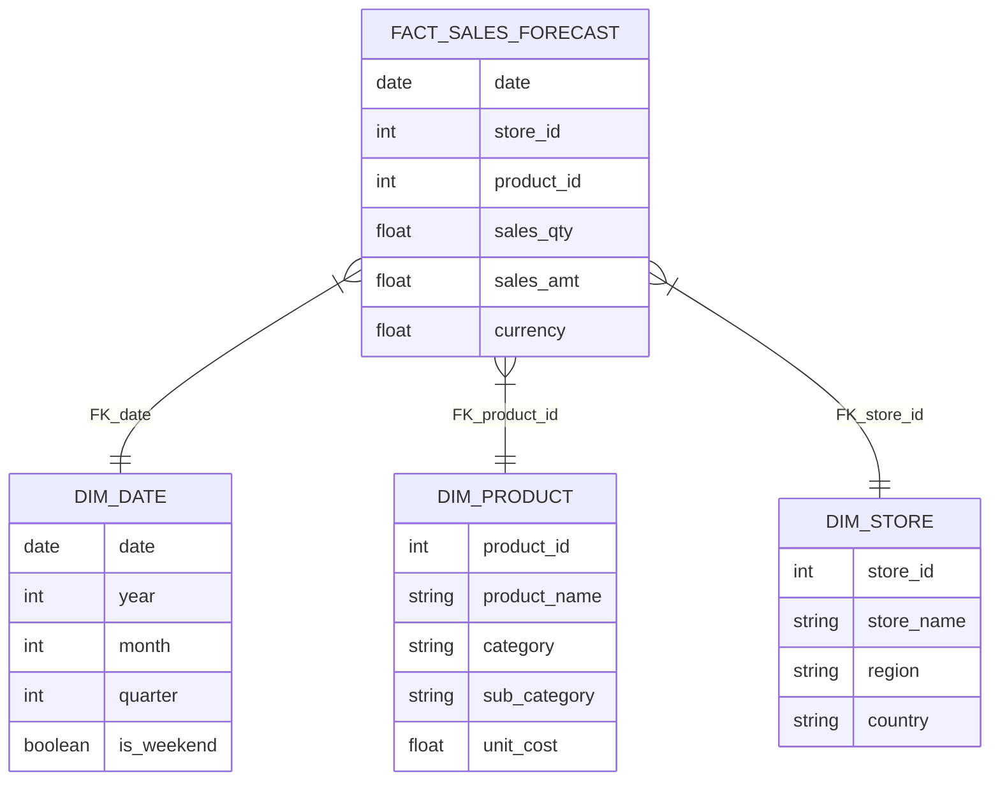

# 🗄️ Data Model & Semantic Layer

> **Overview**: This document details the Star Schema design acting as the "Ground Truth" for the agent, and the Semantic Layer that maps natural language to these structures.

---

## 1. Physical Schema (Star Schema)

We utilize a classic **Star Schema** optimized for analytical queries (OLAP).

### 1.1. Entity Relationship Diagram (ERD)



### 1.2. Table Dictionary

| Table Name | Type | Description | Key Columns |
| :--- | :--- | :--- | :--- |
| `fact_sales_forecast` | **Fact** | Daily transaction grain. Contains actuals and forecast. | `sales_amt`, `sales_qty` |
| `dim_date` | **Dimension** | Calendar attributes for time-series rolling. | `year`, `quarter`, `month` |
| `dim_store` | **Dimension** | Geographical hierarchy. | `region`, `store_name` |
| `dim_product` | **Dimension** | Product catalog hierarchy. | `category`, `product_name` |

---

## 2. The Semantic Layer (The "Brain")

Raw SQL schemas are often cryptic (`t1.c1`). The **Semantic Layer** acts as a dictionary that translates business intent into physical SQL.

### 2.1. Metadata Structure (`metadata.json`)

The agent does not scan the database directly. It scans a **Metadata Knowledge Graph**.

```json
{
  "tables": [
    {
      "name": "fact_sales_forecast",
      "description": "Daily sales transactions and future forecasts.",
      "columns": [
        {
          "name": "revenue",
          "description": "Total sales amount in USD.",
          "synonyms": ["earnings", "income", "turnover", "top line"]
        }
      ]
    }
  ]
}
```

### 2.2. Key Features

1.  **Metric Abstraction**: The user asks for "Revenue". The Semantic Layer maps this to `SUM(sales_amt)`.
2.  **Synonym Mapping**:
    *   *User*: "What are the total **earnings**?"
    *   *Agent*: Sees `synonyms: ["earnings"]` $\rightarrow$ Maps to `revenue` column.
3.  **Vector Indexing**: This metadata file is "Chunked" by table and embedded into the Vector Store. When a user queries, we retrieve only the relevant table definitions, not the whole schema.

---

## 3. Design Decisions

### Why Star Schema?
*   **Predictability**: Joins are always `Fact -> Dimension`. This reduces hallucination risk compared to Snowflake schemas (Chain joins).
*   **Performance**: Optimized for aggregation `SUM/GROUP BY`.

### Why JSON for Metadata?
*   **Portability**: Can be easily migrated to a database or generic Semantic Layer (Cube.js) later.
*   **Editability**: Non-technical domain experts can edit descriptions in the JSON to improve Agent accuracy.
